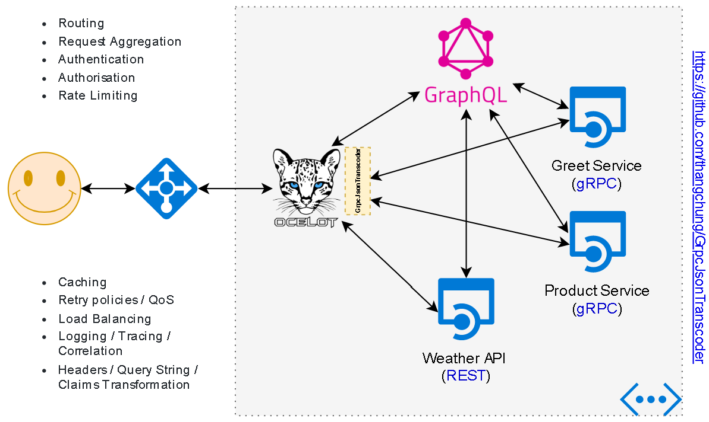

# Grpc-Json Transcoder project

[](https://github.com/thangchung/GrpcJsonTranscoder/blob/master/LICENSE)
[](https://www.nuget.org/packages?q=GrpcJsonTranscoder)

This is a filter that allows a RESTful JSON API client (Ocelot Gateway) to send requests to .NET Web API (Aggregator Service) over HTTP and get proxied to a gRPC service (on the downstream).

This project is inspired by [grpc-gateway](https://github.com/grpc-ecosystem/grpc-gateway) which is totally for golang, [grpc-dynamic-gateway](https://github.com/konsumer/grpc-dynamic-gateway) is for nodejs. And especially, [Envoy gRPC-JSON transcoder](https://www.envoyproxy.io/docs/envoy/latest/configuration/http_filters/grpc_json_transcoder_filter) is the best of transcoding in this area, but it is only on the infrastructure level. You also can use it just like my project used at [coolstore-microservices](https://github.com/vietnam-devs/coolstore-microservices/blob/master/deploys/dockers/envoy-proxy/envoy.yaml). We might use the approach from Microsoft at [GrpcHttpApi](https://github.com/aspnet/AspLabs/blob/master/src/GrpcHttpApi/README.md), but it is not publish in the official release by Microsoft in the meantime.

gRPC parser borrows the idea from [Ocelot.GrpcHttpGateway](https://github.com/BuiltCloud/Ocelot.GrpcHttpGateway) code-based.

## Give a Star!

If you liked [`GrpcJsonTranscoder`](https://github.com/thangchung/GrpcJsonTranscoder) project or if it helped you, please give a star :star: for this repository. That will not only help strengthen our .NET community but also improve cloud-native apps development skills for .NET developers in around the world. Thank you very much :+1:

Check out my [blog](https://medium.com/@thangchung) or say hi on [Twitter](https://twitter.com/thangchung)!

## How to run it!


```bash
$ docker-compose up
```

or 

```bash
$ bash
$ start.sh # I haven't done it yet :p
```

> In the mean time, we open up the visual studio, run multiple projects included OcelotGateway, AggregationRestApi, ProductCatalogGrpcServer and GreatGrpcServer

- OcelotGateway (.NET Core 3.1): 
  - REST: http://localhost:5000
- WeatherServer (.NET Core 3.1): 
  - REST: http://localhost:5001
- ProductCatalogGrpcServer (.NET Core 3.1): 
  - REST: http://localhost:5002
  - gRPC: http://localhost:50022
- GreatGrpcServer (.NET Core 3.1): 
  - gRPC: http://localhost:5003

Test it as below:

```bash
# gRPC
$ curl -X GET -H 'content-type: application/grpc' -k http://localhost:5000/say/Bob
$ {"Message":"Hello Bob"}
```

```bash
# gRPC
$ curl -X GET -H 'content-type: application/grpc' -k http://localhost:5000/products
$ {"Products":[{"Id":1,"Name":"product 1","Quantity":52,"Description":"description of product 1"},...]}
```

```bash
# gRPC
$ curl -X POST -H 'content-type: application/grpc' -d '{ "name": "product 1", "quantity": 1, "description": "this is product 1" }' -k http://localhost:5000/products
$ {"Product":{"Id":915,"Name":"product 1 created","Quantity":1,"Description":"this is product 1 created"}}
```

```bash
# REST Api
$ curl -X GET -H 'content-type: application/json' -k http://localhost:5000/weather 
$ [{"date":"2019-08-17T18:34:41.1090164+07:00","temperatureC":-6,"temperatureF":22,"summary":"Sweltering"},{"date":"2019-08-18T18:34:41.1090371+07:00","temperatureC":27,"temperatureF":80,"summary":"Hot"},{"date":"2019-08-19T18:34:41.1090499+07:00","temperatureC":33,"temperatureF":91,"summary":"Balmy"},{"date":"2019-08-20T18:34:41.1090617+07:00","temperatureC":-14,"temperatureF":7,"summary":"Chilly"},{"date":"2019-08-21T18:34:41.1090743+07:00","temperatureC":22,"temperatureF":71,"summary":"Hot"}]
```

**Notes**:
- REST method: `content-type: application/json` is for REST method on the downstream services.
- gRPC method: `content-type: application/grpc` is really important if you call to `gRPC endpoint` on the downstream services.

## How to understand it!

The project aims to .NET community and its ecosystem which leverage the power of [Ocelot Gateway](https://github.com/ThreeMammals/Ocelot) which is very powerful in the gateway components were used by various of companies and sample source code when we try to adopt the microservices architecture project.



That's quite simple with only a few steps to make it work :)
Create the .NET Core project with Ocelot in place, then put the configuration as below

```json
{
  "ReRoutes": [
    {
      "UpstreamPathTemplate": "/say/{name}",
      "UpstreamHttpMethod": [ "Get" ],
      "DownstreamPathTemplate": "/Greet.Greeter/SayHello",
      "DownstreamScheme": "http",
      "DownstreamHostAndPorts": [
        {
          "Host": "127.0.0.1",
          "Port": 5003
        }
      ]
    },
    {
      "UpstreamPathTemplate": "/products",
      "UpstreamHttpMethod": [ "Get" ],
      "DownstreamPathTemplate": "/ProductCatalog.Product/GetProducts",
      "DownstreamScheme": "http",
      "DownstreamHostAndPorts": [
        {
          "Host": "127.0.0.1",
          "Port": 5002
        }
      ]
    },
    {
      "UpstreamPathTemplate": "/products",
      "UpstreamHttpMethod": [ "Post" ],
      "DownstreamPathTemplate": "/ProductCatalog.Product/CreateProduct",
      "DownstreamScheme": "http",
      "DownstreamHostAndPorts": [
        {
          "Host": "127.0.0.1",
          "Port": 5002
        }
      ]
    },
    {
      "UpstreamPathTemplate": "/weather",
      "UpstreamHttpMethod": [ "Get" ],
      "DownstreamPathTemplate": "/weatherforecast",
      "DownstreamScheme": "http",
      "DownstreamHostAndPorts": [
        {
          "Host": "localhost",
          "Port": 5001
        }
      ]
    }
  ],
  "GlobalConfiguration": {
  }
}
```

Then in code `Program.cs`, you only put a few line

```csharp
var configuration = new OcelotPipelineConfiguration
{
    PreQueryStringBuilderMiddleware = async (ctx, next) =>
    {
        await ctx.HandleGrpcRequestAsync(next);
    }
};

app.UseOcelot(configuration).Wait();
```

### **Don't believe what I said. Try it!**

> We haven't tested it with stream and full-duplex transport protocols yet. So we feel free to contribute by the .NET community.

## Contributing

1. Fork it!
2. Create your feature branch: `git checkout -b my-new-feature`
3. Commit your changes: `git commit -am 'Add some feature'`
4. Push to the branch: `git push origin my-new-feature`
5. Submit a pull request :p